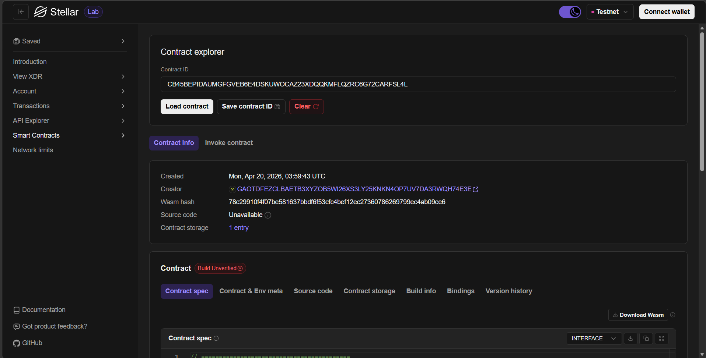

# 🏫 Campus Lending DApp

**Campus Lending DApp** — A Decentralized Campus Asset Lending System on Stellar Blockchain

## Project Description

Campus Lending DApp is a decentralized smart contract solution built on the **Stellar blockchain** using the **Soroban SDK**. It provides a transparent and trustless platform for managing the lending and borrowing of campus assets — such as electronics, sports equipment, rooms, and tools — directly on-chain.

The system replaces traditional paper-based or spreadsheet-driven campus inventory management with an immutable, blockchain-powered solution. It enables administrators to manage inventory, while students and staff can borrow, return, and extend loans with full on-chain accountability.

## Key Features

### 1. 📦 Inventory Management (Admin)
- **Add Items** — Register new campus assets with name, category, description, location, and quantity
- **Update Status** — Mark items as Available, Borrowed, or Under Maintenance
- **Update Quantity** — Add more units to existing items
- **Remove Items** — Delete items from inventory (only if no units are currently borrowed)

### 2. 🔄 Loan Transactions
- **Borrow Item** — Students/staff can borrow available items by specifying purpose and duration (1–30 days)
- **Return Item** — Return borrowed items; automatically detects on-time vs. overdue returns
- **Extend Loan** — One-time extension of up to 7 additional days (only before the deadline)

### 3. 🔍 Query & Filtering
- **Get All Items** — View the complete campus inventory
- **Get Available Items** — Filter only items with available stock
- **Get Items by Category** — Filter by Electronics, Sports, Rooms, or Equipment
- **Get All Loans** — Admin view of all loan transactions
- **Get Loans by User** — View loan history for a specific wallet address
- **Get Active Loans** — List all currently active borrowings
- **Get Overdue Loans** — Identify items returned late or still past deadline

### 4. 📊 Dashboard Statistics
- Total item types and units in the system
- Available vs. borrowed unit counts
- Active, completed, and overdue loan counts

### 5. 🔒 Security & Access Control
- Admin-only functions protected by `require_auth()` and admin address verification
- Borrower authentication ensures only the original borrower can return or extend a loan
- One-time initialization prevents contract re-initialization

## Smart Contract Functions

| Function | Access | Description |
|---|---|---|
| `initialize(admin)` | Once | Initialize the contract with admin address |
| `add_item(admin, name, category, desc, location, qty)` | Admin | Add new item to inventory |
| `update_item_status(admin, item_id, status)` | Admin | Change item status |
| `update_item_quantity(admin, item_id, qty)` | Admin | Add more units |
| `remove_item(admin, item_id)` | Admin | Remove item from inventory |
| `borrow_item(borrower, item_id, purpose, days)` | User | Borrow an item |
| `return_item(borrower, loan_id)` | User | Return a borrowed item |
| `extend_loan(borrower, loan_id, days)` | User | Extend loan duration |
| `get_all_items()` | Public | Get all inventory items |
| `get_available_items()` | Public | Get available items only |
| `get_items_by_category(category)` | Public | Filter items by category |
| `get_all_loans()` | Public | Get all loan records |
| `get_loans_by_user(borrower)` | Public | Get user's loan history |
| `get_active_loans()` | Public | Get currently active loans |
| `get_overdue_loans()` | Public | Get overdue loans |
| `get_statistics()` | Public | Get dashboard statistics |

## Contract Details

- **Network**: Stellar Testnet (Soroban)
- **Contract ID**: `CB45BEPIDAUMGFGVEB6E4DSKUWOCAZ23XDQQKMFLQZRC6G72CARFSL4L`

### Testnet Deployment Screenshot



## Data Models

### Item
```
Item {
    id: u64,
    name: String,
    category: ItemCategory,        // Electronics | Sports | Rooms | Equipment
    description: String,
    location: String,
    status: ItemStatus,            // Available | Borrowed | UnderMaintenance
    total_quantity: u32,
    available_quantity: u32,
}
```

### Loan
```
Loan {
    id: u64,
    item_id: u64,
    borrower: Address,
    purpose: String,
    borrow_date: u64,              // Unix timestamp
    planned_return_date: u64,      // Unix timestamp
    actual_return_date: u64,       // 0 = not yet returned
    status: LoanStatus,           // Active | Completed | Overdue
    extended: bool,
}
```

### Statistics
```
Statistics {
    total_item_types: u32,
    total_units: u32,
    available_units: u32,
    borrowed_units: u32,
    total_loans: u32,
    active_loans: u32,
    completed_loans: u32,
    overdue_loans: u32,
}
```

## Technical Stack

| Component | Technology |
|---|---|
| Blockchain | Stellar (Soroban) |
| Language | Rust |
| SDK | Soroban SDK v21.0.0 |
| Testing | Soroban SDK testutils |

## Getting Started

### Prerequisites
- [Rust](https://www.rust-lang.org/tools/install) (with `wasm32-unknown-unknown` target)
- [Soroban CLI](https://soroban.stellar.org/docs/getting-started/setup)
- [Stellar CLI](https://developers.stellar.org/docs/tools/developer-tools)

### Build
```bash
cargo build --target wasm32-unknown-unknown --release
```

### Test
```bash
cargo test
```

### Example: Add an Item
```bash
stellar contract invoke \
  --id <CONTRACT_ID> \
  --source deployer \
  --network testnet \
  -- add_item \
  --admin <ADMIN_ADDRESS> \
  --name "Epson Projector" \
  --category Electronics \
  --description "3800 lumen HD projector" \
  --location "Building A, AV Storage" \
  --quantity 3
```

### Example: Borrow an Item
```bash
stellar contract invoke \
  --id <CONTRACT_ID> \
  --source student \
  --network testnet \
  -- borrow_item \
  --borrower <STUDENT_ADDRESS> \
  --item_id 1 \
  --purpose "Thesis presentation" \
  --duration_days 3
```

## Test Coverage

The contract includes **20 comprehensive tests** covering:

- ✅ Contract initialization (single-use guard)
- ✅ Item CRUD operations (add, update status, update quantity, remove)
- ✅ Borrowing flow (success, out-of-stock, non-existent item, maintenance block)
- ✅ Return flow (on-time completion, overdue detection, unauthorized user block)
- ✅ Loan extension (success, double-extension block, past-deadline block, unauthorized block)
- ✅ Query filters (available items, category filter, user history, active/overdue loans)
- ✅ Statistics aggregation

## Future Scope

1. **Penalty System** — Automated penalty calculation for overdue returns
2. **Approval Workflow** — Admin approval required before loan is activated
3. **Reservation System** — Reserve items in advance for specific dates
4. **Notification Bridge** — Off-chain notifications for due dates and overdue reminders
5. **Multi-Campus Support** — Scale to multiple campuses with cross-campus asset sharing
6. **Audit Trail** — Complete immutable log of all inventory changes

---

**Campus Lending DApp** — Transparent Asset Management on the Blockchain 🚀
